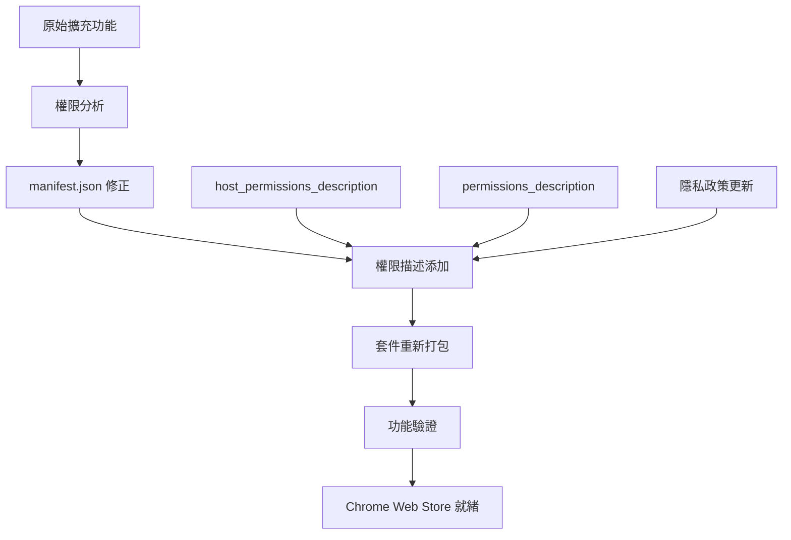

# 設計文件

## 概述

Chrome 擴充功能權限描述修正的設計方案，主要針對 manifest.json 檔案的權限說明欄位進行完善，確保符合 Chrome Web Store 的最新政策要求。此設計採用最小侵入性原則，只修改必要的配置檔案，不影響現有功能。

## 架構

### 系統架構圖



### 核心組件

1. **權限分析器** - 分析現有權限配置
2. **描述生成器** - 生成符合要求的權限說明
3. **Manifest 更新器** - 更新 manifest.json 檔案
4. **套件打包器** - 重新打包擴充功能
5. **功能驗證器** - 確保修正後功能正常

## 組件和介面

### 1. 權限配置結構

```json
{
  "permissions": ["activeTab", "scripting"],
  "host_permissions": ["https://cdn.jsdelivr.net/*"],
  "permissions_description": "完整權限說明",
  "host_permissions_description": "主機權限專門說明"
}
```

### 2. 權限描述模板

#### 主機權限描述 (host_permissions_description)
```
需要存取 https://cdn.jsdelivr.net 來載入 OpenCC 簡體轉繁體轉換函式庫。這是提供高品質中文轉換功能的必要組件，我們只載入官方 OpenCC 函式庫，不會傳送任何使用者資料到此網站。
```

#### 整體權限描述 (permissions_description)
```
此擴充功能需要以下權限：1) activeTab 權限來讀取當前分頁的標題和網址；2) scripting 權限來執行複製到剪貼簿的功能；3) 存取 https://cdn.jsdelivr.net 來載入官方 OpenCC 簡體轉繁體轉換函式庫。我們使用 OpenCC 進行高品質的簡體轉繁體轉換，只載入必要的轉換函式庫，不會收集或儲存任何個人資料。
```

### 3. 檔案結構

```
extension-with-real-opencc/
├── manifest.json (更新)
├── service-worker.js
├── content-script-real-opencc.js
├── opencc-browser-integration.js
├── privacy-policy.html (更新)
└── icons/
    ├── icon16.png
    ├── icon32.png
    ├── icon48.png
    └── icon128.png
```

## 資料模型

### 權限配置模型

```typescript
interface PermissionConfig {
  permissions: string[];
  host_permissions: string[];
  permissions_description: string;
  host_permissions_description: string;
}

interface ManifestV3 {
  manifest_version: 3;
  name: string;
  version: string;
  description: string;
  permissions: string[];
  host_permissions?: string[];
  permissions_description?: string;
  host_permissions_description?: string;
  background: {
    service_worker: string;
  };
  content_scripts?: ContentScript[];
  icons: IconSet;
}
```

### 驗證模型

```typescript
interface ValidationResult {
  isValid: boolean;
  errors: string[];
  warnings: string[];
  suggestions: string[];
}

interface PermissionValidation {
  hasPermissionsDescription: boolean;
  hasHostPermissionsDescription: boolean;
  descriptionLength: number;
  containsRequiredKeywords: boolean;
}
```

## 錯誤處理

### 1. 權限描述驗證

```javascript
function validatePermissionDescriptions(manifest) {
  const errors = [];
  
  // 檢查是否有 host_permissions 但缺少描述
  if (manifest.host_permissions && !manifest.host_permissions_description) {
    errors.push('缺少 host_permissions_description 欄位');
  }
  
  // 檢查描述長度
  if (manifest.permissions_description && manifest.permissions_description.length < 50) {
    errors.push('permissions_description 太短，建議至少 50 字元');
  }
  
  return errors;
}
```

### 2. 套件完整性檢查

```javascript
function validatePackageIntegrity(packagePath) {
  const requiredFiles = [
    'manifest.json',
    'service-worker.js',
    'icons/icon16.png',
    'icons/icon32.png',
    'icons/icon48.png',
    'icons/icon128.png'
  ];
  
  return requiredFiles.every(file => 
    fs.existsSync(path.join(packagePath, file))
  );
}
```

### 3. 功能回歸測試

```javascript
async function testExtensionFunctionality() {
  const tests = [
    testOpenCCLoading,
    testTextConversion,
    testPageInfoCopy,
    testPermissionGrants
  ];
  
  for (const test of tests) {
    try {
      await test();
    } catch (error) {
      console.error(`測試失敗: ${test.name}`, error);
      throw error;
    }
  }
}
```

## 測試策略

### 1. 單元測試

- **權限描述生成測試** - 驗證描述文字的正確性
- **Manifest 更新測試** - 確保 JSON 結構正確
- **檔案完整性測試** - 檢查所有必要檔案存在

### 2. 整合測試

- **套件打包測試** - 驗證 ZIP 檔案結構
- **Chrome 載入測試** - 確保擴充功能可正常載入
- **權限授予測試** - 驗證權限請求流程

### 3. 端到端測試

- **Chrome Web Store 上傳模擬** - 模擬上傳流程
- **使用者安裝體驗** - 測試完整安裝流程
- **功能完整性測試** - 確保所有功能正常運作

### 4. 合規性測試

```javascript
const complianceTests = {
  // 檢查權限描述完整性
  checkPermissionDescriptions: () => {
    const manifest = JSON.parse(fs.readFileSync('manifest.json'));
    return manifest.host_permissions_description && 
           manifest.permissions_description;
  },
  
  // 檢查描述內容品質
  checkDescriptionQuality: () => {
    const manifest = JSON.parse(fs.readFileSync('manifest.json'));
    const desc = manifest.host_permissions_description;
    return desc.includes('OpenCC') && 
           desc.includes('不會傳送') && 
           desc.includes('必要組件');
  },
  
  // 檢查隱私政策一致性
  checkPrivacyPolicyConsistency: () => {
    const policy = fs.readFileSync('privacy-policy.html', 'utf8');
    return policy.includes('OpenCC') && 
           policy.includes('不收集個人資料');
  }
};
```

## 實作流程

### 階段 1：分析與準備
1. 分析現有 manifest.json 檔案
2. 識別缺少的權限描述
3. 準備描述文字模板

### 階段 2：檔案修正
1. 更新 manifest.json 添加權限描述
2. 更新 privacy-policy.html 保持一致性
3. 驗證 JSON 格式正確性

### 階段 3：套件重建
1. 清理舊的建置檔案
2. 重新打包擴充功能
3. 生成新的 ZIP 檔案

### 階段 4：測試驗證
1. 本地安裝測試
2. 功能完整性測試
3. 權限授予流程測試

### 階段 5：部署準備
1. 最終合規性檢查
2. 生成上傳就緒的套件
3. 準備 Chrome Web Store 提交資料

## 品質保證

### 自動化檢查
- ESLint 程式碼品質檢查
- JSON 格式驗證
- 檔案完整性檢查
- 權限描述內容檢查

### 手動審查
- 權限描述文字品質
- 使用者體驗流程
- Chrome Web Store 政策合規性
- 功能回歸測試

### 持續監控
- Chrome Web Store 審核狀態
- 使用者安裝成功率
- 權限授予接受率
- 功能錯誤報告

這個設計確保了修正過程的完整性和可靠性，同時最小化對現有功能的影響。