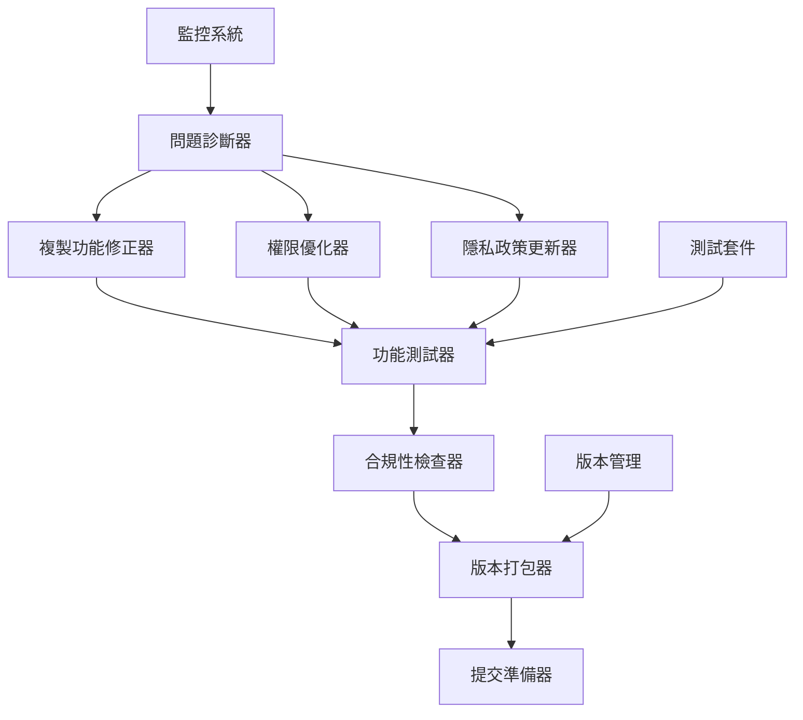

# 設計文件

## 概述

Chrome Web Store 立即修正系統專門針對 Quick Text Copy 擴充功能當前遇到的審核拒絕問題。系統將重點解決複製功能失效、權限配置不當、隱私政策不符等核心問題，確保快速通過重新審核。

## 架構

### 系統架構圖



### 核心組件

1. **複製功能修正模組**
   - 診斷當前複製功能問題
   - 實作現代 Clipboard API
   - 提供降級方案支援
   - 添加使用者回饋機制

2. **權限優化模組**
   - 分析當前權限使用情況
   - 移除不必要的權限
   - 優化 manifest.json 配置
   - 添加權限說明文件

3. **隱私政策合規模組**
   - 檢查當前資料處理行為
   - 更新隱私政策內容
   - 確保法規合規性
   - 生成合規報告

4. **快速提交模組**
   - 自動版本號更新
   - 生成變更日誌
   - 打包發佈檔案
   - 準備提交說明

## 組件和介面

### 1. ClipboardFixer 類別

```typescript
interface ClipboardFixer {
  diagnoseClipboardIssues(): Promise<DiagnosisResult>
  implementModernAPI(): Promise<void>
  addFallbackSupport(): Promise<void>
  testClipboardFunctionality(): Promise<TestResult>
  addUserFeedback(): Promise<void>
}
```

### 2. PermissionOptimizer 類別

```typescript
interface PermissionOptimizer {
  analyzeCurrentPermissions(): Promise<PermissionAnalysis>
  removeUnnecessaryPermissions(): Promise<void>
  updateManifest(): Promise<void>
  generatePermissionDocs(): Promise<void>
  validatePermissions(): Promise<ValidationResult>
}
```

### 3. PrivacyComplianceUpdater 類別

```typescript
interface PrivacyComplianceUpdater {
  auditDataProcessing(): Promise<DataAudit>
  updatePrivacyPolicy(): Promise<void>
  ensureGDPRCompliance(): Promise<ComplianceResult>
  generateComplianceReport(): Promise<Report>
}
```

### 4. QuickSubmissionManager 類別

```typescript
interface QuickSubmissionManager {
  updateVersion(): Promise<string>
  generateChangelog(): Promise<void>
  packageExtension(): Promise<PackageResult>
  prepareSubmissionNotes(): Promise<string>
  submitForReview(): Promise<SubmissionResult>
}
```

## 資料模型

### DiagnosisResult
```typescript
interface DiagnosisResult {
  clipboardIssues: ClipboardIssue[]
  permissionIssues: PermissionIssue[]
  privacyIssues: PrivacyIssue[]
  severity: 'critical' | 'high' | 'medium' | 'low'
  estimatedFixTime: string
}
```

### FixPlan
```typescript
interface FixPlan {
  clipboardFixes: ClipboardFix[]
  permissionFixes: PermissionFix[]
  privacyFixes: PrivacyFix[]
  testingPlan: TestPlan
  submissionPlan: SubmissionPlan
}
```

### ComplianceResult
```typescript
interface ComplianceResult {
  isCompliant: boolean
  checkedAreas: {
    clipboard: boolean
    permissions: boolean
    privacy: boolean
    manifest: boolean
  }
  issues: ComplianceIssue[]
  recommendations: string[]
}
```

## 錯誤處理

### 錯誤分類和處理策略

1. **複製功能錯誤**
   - API 不支援：實作降級方案
   - 權限被拒：提供使用者指引
   - 瀏覽器相容性：多重實作策略

2. **權限配置錯誤**
   - 過度權限：自動移除不必要權限
   - 權限不足：添加必要權限並說明
   - 配置錯誤：自動修正 manifest.json

3. **隱私政策錯誤**
   - 政策過時：自動更新至最新版本
   - 不符法規：添加必要的合規聲明
   - 資料處理不明：詳細說明資料用途

### 回滾機制

```typescript
interface RollbackStrategy {
  backupOriginalFiles: () => Promise<void>
  createRestorePoint: () => Promise<string>
  rollbackChanges: (restorePointId: string) => Promise<void>
  validateRollback: () => Promise<boolean>
}
```

## 測試策略

### 1. 功能測試
- 複製功能在各種情境下的測試
- 權限請求和處理測試
- 使用者介面互動測試

### 2. 合規性測試
- Chrome Web Store 政策合規檢查
- 隱私政策與實際行為一致性檢查
- 權限使用合理性檢查

### 3. 相容性測試
- 不同 Chrome 版本相容性
- 不同作業系統相容性
- 各種網站環境測試

### 4. 自動化測試

```typescript
interface TestSuite {
  runClipboardTests(): Promise<TestResult[]>
  runPermissionTests(): Promise<TestResult[]>
  runPrivacyTests(): Promise<TestResult[]>
  runIntegrationTests(): Promise<TestResult[]>
  generateTestReport(): Promise<TestReport>
}
```

## 實作優先級

### 第一階段：核心功能修正
1. 修正複製到剪貼簿功能
2. 優化權限配置
3. 基本功能測試

### 第二階段：合規性確保
1. 更新隱私政策
2. 全面合規性檢查
3. 生成合規報告

### 第三階段：提交準備
1. 版本更新和打包
2. 生成提交說明
3. 最終驗證和提交

## 監控和驗證

### 1. 即時監控
- 修正過程狀態追蹤
- 錯誤即時報告
- 進度可視化

### 2. 品質保證
- 每個修正步驟的驗證
- 自動化測試執行
- 人工審查檢查點

### 3. 提交後監控
- 審核狀態追蹤
- 問題回饋收集
- 成功率統計

## 安全考量

### 1. 資料安全
- 使用者資料最小化收集
- 敏感資訊加密處理
- 安全的資料傳輸

### 2. 權限安全
- 最小權限原則
- 權限使用透明化
- 使用者控制機制

### 3. 程式碼安全
- 輸入驗證和清理
- XSS 防護機制
- 安全的 API 呼叫