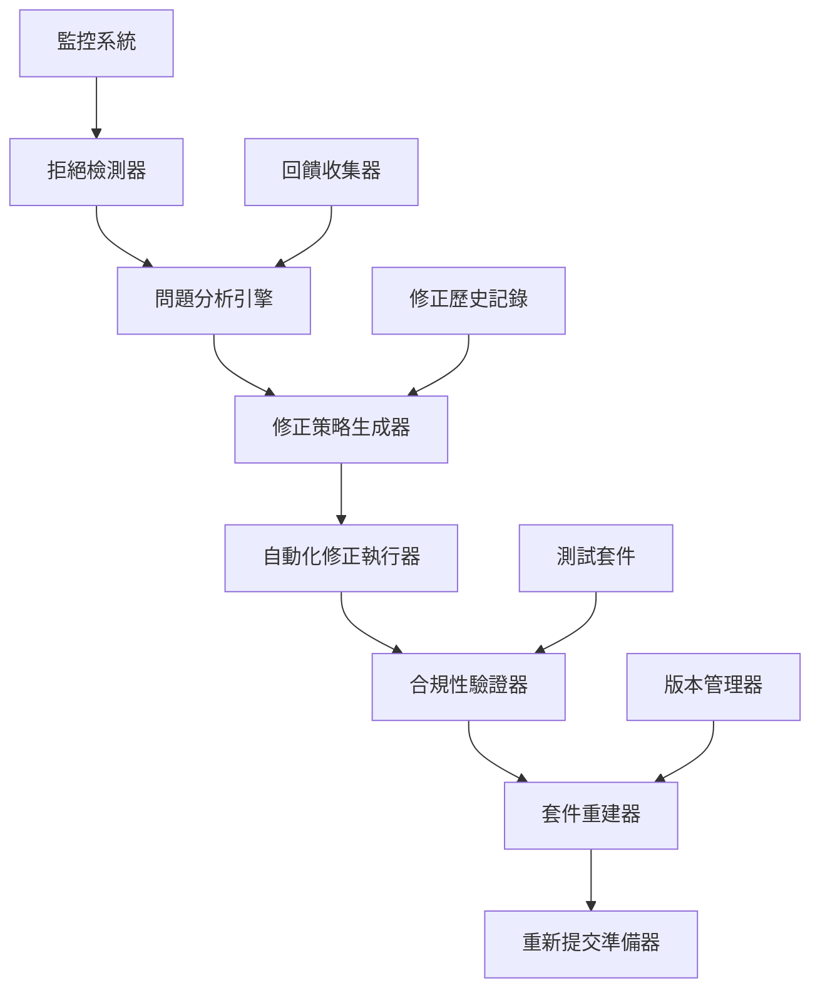

# 設計文件

## 概述

Chrome Web Store審核拒絕修正系統是一個智能化的問題診斷和修正平台，旨在自動化處理擴充功能審核被拒絕的情況。系統將整合現有的合規性檢查工具、權限分析器和自動化修正腳本，提供端到端的問題解決方案。

基於當前的技術架構分析，系統將利用現有的 `handle-review-rejection.js`、`compliance-checker.js` 和相關工具，建立一個統一的修正流程。

## 架構

### 系統架構圖



### 核心組件

1. **拒絕檢測和分析模組**
   - 自動監控審核狀態
   - 解析拒絕原因和詳細回饋
   - 分類問題類型（權限、功能、政策等）

2. **智能修正引擎**
   - 基於問題類型生成修正策略
   - 整合現有的自動化修正工具
   - 支援分階段修正計畫

3. **合規性驗證系統**
   - 整合現有的 compliance-checker
   - 執行全面的Chrome Web Store要求檢查
   - 生成詳細的合規性報告

4. **自動化重建和提交系統**
   - 版本號管理和更新
   - 套件重建和檔案完整性檢查
   - 提交準備和文件生成

## 組件和介面

### 1. RejectionAnalyzer 類別

```typescript
interface RejectionAnalyzer {
  analyzeRejection(rejectionData: RejectionData): Promise<AnalysisResult>
  categorizeIssues(issues: Issue[]): CategoryMap
  assessSeverity(issue: Issue): SeverityLevel
  generateRecommendations(analysis: AnalysisResult): Recommendation[]
}
```

### 2. AutoFixEngine 類別

```typescript
interface AutoFixEngine {
  createFixPlan(analysis: AnalysisResult): FixPlan
  executeFixPlan(plan: FixPlan): Promise<FixResult>
  rollbackChanges(fixId: string): Promise<void>
  validateFix(fixResult: FixResult): Promise<ValidationResult>
}
```

### 3. ComplianceValidator 類別

```typescript
interface ComplianceValidator {
  runFullCompliance(): Promise<ComplianceReport>
  checkPermissions(): Promise<PermissionReport>
  validateManifest(): Promise<ManifestReport>
  checkPrivacyPolicy(): Promise<PrivacyReport>
}
```

### 4. SubmissionManager 類別

```typescript
interface SubmissionManager {
  prepareResubmission(fixResult: FixResult): Promise<SubmissionPackage>
  updateVersion(versionType: 'patch' | 'minor'): Promise<string>
  generateChangelog(changes: Change[]): string
  createSubmissionNotes(fixSummary: FixSummary): string
}
```

## 資料模型

### RejectionData
```typescript
interface RejectionData {
  rejectionId: string
  timestamp: string
  reason: string
  details: string
  category: RejectionCategory
  severity: SeverityLevel
  reviewerComments?: string[]
  previousSubmissions: SubmissionHistory[]
}
```

### FixPlan
```typescript
interface FixPlan {
  planId: string
  phases: FixPhase[]
  estimatedDuration: string
  riskLevel: RiskLevel
  rollbackStrategy: RollbackStrategy
  validationSteps: ValidationStep[]
}
```

### ComplianceReport
```typescript
interface ComplianceReport {
  isCompliant: boolean
  overallScore: number
  checks: {
    manifest: CheckResult
    permissions: CheckResult
    files: CheckResult
    content: CheckResult
    privacy: CheckResult
  }
  criticalIssues: Issue[]
  recommendations: Recommendation[]
}
```

## 錯誤處理

### 錯誤分類和處理策略

1. **系統錯誤**
   - 檔案系統錯誤：自動重試機制
   - 網路錯誤：指數退避重試
   - 權限錯誤：提供詳細的權限指南

2. **業務邏輯錯誤**
   - 無法識別的拒絕原因：人工介入流程
   - 修正失敗：自動回滾到上一個穩定版本
   - 合規性檢查失敗：阻止提交並提供詳細報告

3. **外部服務錯誤**
   - Chrome Web Store API錯誤：記錄並通知管理員
   - 第三方工具錯誤：降級到手動處理模式

### 回滾機制

```typescript
interface RollbackStrategy {
  automaticTriggers: string[]
  backupPoints: BackupPoint[]
  rollbackSteps: RollbackStep[]
  verificationChecks: VerificationCheck[]
}
```

## 測試策略

### 1. 單元測試
- 每個核心類別的方法測試
- 錯誤處理邏輯測試
- 資料驗證和轉換測試

### 2. 整合測試
- 完整修正流程測試
- 外部工具整合測試
- 檔案系統操作測試

### 3. 端到端測試
- 模擬拒絕情境測試
- 完整修正和重新提交流程測試
- 回滾機制測試

### 4. 合規性測試
- Chrome Web Store要求驗證
- 權限和隱私政策檢查
- 功能完整性測試

### 測試資料管理

```typescript
interface TestScenario {
  scenarioId: string
  rejectionType: RejectionCategory
  mockData: MockRejectionData
  expectedOutcome: ExpectedResult
  validationCriteria: ValidationCriteria[]
}
```

## 監控和日誌

### 1. 操作日誌
- 所有修正動作的詳細記錄
- 時間戳記和操作者資訊
- 修正前後的狀態比較

### 2. 效能監控
- 修正流程執行時間
- 成功率和失敗率統計
- 資源使用情況監控

### 3. 警報機制
- 修正失敗自動警報
- 合規性問題即時通知
- 系統異常狀況警報

## 安全考量

### 1. 資料保護
- 敏感資訊加密儲存
- 存取權限控制
- 審計日誌記錄

### 2. 操作安全
- 修正動作的權限驗證
- 自動備份機制
- 變更審核流程

### 3. 外部整合安全
- API金鑰安全管理
- 第三方服務驗證
- 網路通訊加密