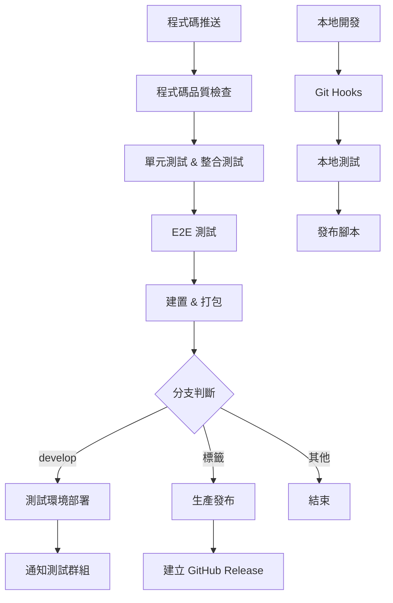

# CI/CD 自動化測試與部署系統設計文件

## 概述

本設計文件描述了為 Google 外掛專案建立的完整 CI/CD 自動化流程。系統採用 GitHub Actions 作為核心 CI/CD 平台，整合多種測試工具和自動化腳本，實現從程式碼提交到生產發布的全自動化流程。

## 架構

### 整體架構圖



### 流程階段設計

#### 第一階段：程式碼品質檢查
- **觸發條件**: 推送到 main/develop 分支或建立 PR
- **執行環境**: Ubuntu Latest, Node.js 18
- **檢查項目**: ESLint、Prettier 格式檢查
- **失敗處理**: 阻止後續流程，提供詳細錯誤報告

#### 第二階段：自動化測試
- **依賴**: 程式碼品質檢查通過
- **測試類型**: 
  - 單元測試 (Jest)
  - 整合測試 (Jest)
  - 測試覆蓋率生成
- **輸出**: 測試報告、覆蓋率報告上傳為 artifacts

#### 第三階段：E2E 測試
- **依賴**: 基礎測試通過
- **測試工具**: Playwright + Chromium
- **測試範圍**: Chrome 擴充功能載入、彈出視窗、核心功能流程
- **錯誤處理**: 失敗時自動截圖保存

#### 第四階段：建置與打包
- **依賴**: 所有測試通過
- **處理流程**:
  1. 簡繁轉換處理 (OpenCC)
  2. 生產版本建置 (Webpack)
  3. 擴充功能打包 (ZIP)
  4. 版本號提取和環境變數設定
- **輸出**: 建置成品上傳為 artifacts

#### 第五階段：條件部署
- **測試環境部署** (develop 分支):
  - 下載建置成品
  - 部署到測試環境
  - Webhook 通知測試群組
- **生產發布** (版本標籤):
  - 自動生成 changelog
  - 建立 GitHub Release
  - 上傳擴充功能包

## 元件和介面

### GitHub Actions 工作流程

#### 主要工作流程檔案
- **檔案位置**: `.github/workflows/main.yml`
- **觸發事件**: push, pull_request, workflow_dispatch
- **環境變數**: EXTENSION_NAME, NODE_VERSION

#### 工作階段 (Jobs)
1. **quality-check**: 程式碼品質檢查
2. **test**: 執行測試套件
3. **e2e-test**: E2E 測試
4. **build**: 建置與打包
5. **deploy-test**: 測試環境部署
6. **release**: 生產發布

### 測試框架整合

#### Jest 配置
- **單元測試**: `tests/unit/**/*.test.js`
- **整合測試**: `tests/integration/**/*.test.js`
- **覆蓋率**: HTML 報告生成
- **配置檔案**: `jest.config.js`

#### Playwright E2E 測試
- **瀏覽器**: Chromium (Chrome 擴充功能專用)
- **測試檔案**: `tests/e2e/**/*.spec.js`
- **功能測試**: 擴充功能載入、彈出視窗、核心功能
- **截圖**: 錯誤狀態自動截圖

### 建置系統

#### Webpack 配置
- **開發模式**: `webpack --mode development`
- **生產模式**: `webpack --mode production`
- **監控模式**: `webpack --mode development --watch`

#### 簡繁轉換系統
- **工具**: OpenCC-JS
- **轉換方向**: 簡體中文 → 繁體中文
- **處理檔案**: `.js`, `.json`, `.html`, `.css`
- **處理目錄**: `src/`, `dist/`

### 打包系統
- **工具**: Archiver (Node.js)
- **格式**: ZIP
- **包含檔案**: `dist/`, `manifest.json`, `README.md`
- **輸出**: `package.zip`

## 資料模型

### 版本資訊模型
```javascript
{
  version: "1.0.5",
  buildNumber: "auto-generated",
  commitId: "git-commit-hash",
  buildTime: "ISO-timestamp",
  branch: "main|develop|feature/*"
}
```

### 測試結果模型
```javascript
{
  unitTests: {
    passed: number,
    failed: number,
    coverage: percentage
  },
  integrationTests: {
    passed: number,
    failed: number
  },
  e2eTests: {
    passed: number,
    failed: number,
    screenshots: [string]
  }
}
```

### 部署狀態模型
```javascript
{
  environment: "test|production",
  status: "success|failed|in-progress",
  version: "1.0.5",
  deployTime: "ISO-timestamp",
  artifacts: [string]
}
```

## 錯誤處理

### 測試失敗處理
- **單元/整合測試失敗**: 保留測試報告，阻止後續流程
- **E2E 測試失敗**: 自動截圖，上傳錯誤狀態圖片
- **覆蓋率不足**: 警告但不阻止流程

### 建置失敗處理
- **簡繁轉換失敗**: 記錄錯誤，使用原始檔案繼續
- **Webpack 建置失敗**: 停止流程，提供詳細錯誤訊息
- **打包失敗**: 檢查檔案完整性，重試一次

### 部署失敗處理
- **測試環境部署失敗**: 通知開發團隊，保留上一版本
- **生產發布失敗**: 建立 draft release，等待手動確認
- **通知失敗**: 記錄到日誌，不影響主流程

## 測試策略

### 測試金字塔
1. **單元測試** (70%):
   - 官網文章生成功能
   - 簡繁轉換功能
   - 工具函數測試
   
2. **整合測試** (20%):
   - GitHub 同步功能
   - API 整合測試
   - 檔案處理流程
   
3. **E2E 測試** (10%):
   - 擴充功能載入
   - 使用者介面互動
   - 完整功能流程

### 測試環境
- **本地開發**: Jest watch 模式
- **CI 環境**: 完整測試套件 + 覆蓋率
- **E2E 環境**: Headless Chromium + 截圖

### 測試資料管理
- **測試夾具**: `tests/fixtures/`
- **模擬資料**: Jest mocks
- **測試環境變數**: 獨立配置檔案

## 安全考量

### 敏感資訊管理
- **GitHub Token**: 使用 GitHub Secrets
- **Webhook URL**: 環境變數保護
- **API Keys**: 測試環境使用假資料

### 權限控制
- **GitHub Actions**: 最小權限原則
- **測試環境**: 隔離部署
- **生產發布**: 需要標籤推送權限

### 資料保護
- **測試資料**: 不包含真實使用者資料
- **日誌**: 過濾敏感資訊
- **Artifacts**: 自動過期清理

## 效能最佳化

### 建置最佳化
- **快取策略**: Node.js 依賴快取
- **並行執行**: 獨立測試並行運行
- **增量建置**: 只建置變更檔案

### 測試最佳化
- **測試分組**: 快速測試優先執行
- **資源重用**: 測試環境共享
- **超時設定**: 合理的測試超時時間

### 部署最佳化
- **Artifact 重用**: 避免重複建置
- **壓縮傳輸**: 最小化傳輸檔案大小
- **回滾機制**: 快速回滾到上一版本