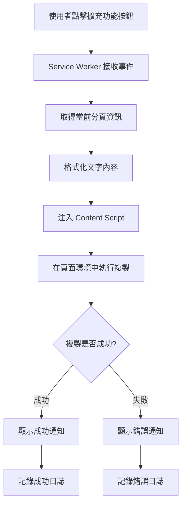
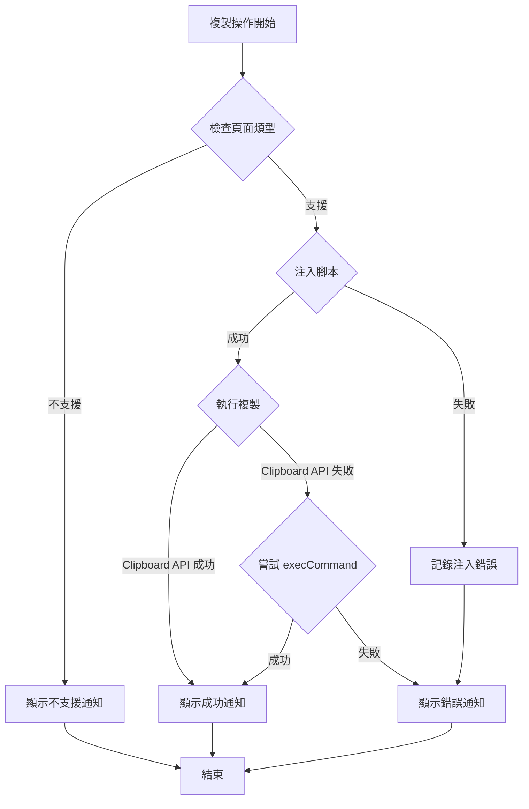

# 設計文件

## 概述

本設計旨在修正 Quick Text Copy 擴充功能的剪貼簿複製功能，解決 Chrome Web Store 審核拒絕的核心問題。當前實作在 Service Worker 中使用 `chrome.scripting.executeScript` 來執行複製操作，但這種方式可能在某些情境下失敗。我們需要改進複製機制，確保在所有標準網頁上都能穩定運作。

## 問題診斷

### 當前實作的問題

1. **權限問題**：Service Worker 環境無法直接存取 Clipboard API
2. **執行環境**：在某些網頁上，動態注入的腳本可能被 CSP（Content Security Policy）阻擋
3. **錯誤處理**：當前的錯誤處理不夠完善，無法提供清晰的失敗原因
4. **使用者回饋**：沒有視覺化的成功/失敗通知

### 根本原因

Chrome Manifest V3 的 Service Worker 環境與傳統的背景頁面不同，無法直接操作 DOM 或存取某些 Web API。複製到剪貼簿的操作需要在有 DOM 環境的上下文中執行。

## 架構

### 系統架構圖



### 核心組件

1. **Service Worker (service-worker.js)**
   - 監聽擴充功能按鈕點擊事件
   - 取得並格式化當前分頁資訊
   - 協調複製流程
   - 顯示通知

2. **複製執行腳本**
   - 在頁面環境中執行
   - 使用 Clipboard API（主要方法）
   - 使用 execCommand（備用方法）
   - 返回執行結果

3. **通知系統**
   - 成功通知：顯示複製的內容預覽
   - 失敗通知：顯示錯誤原因和建議
   - 自動關閉機制

## 組件和介面

### 1. ClipboardHandler 改進

```javascript
class ClipboardHandler {
  /**
   * 複製文字到剪貼簿（改進版）
   * @param {string} text - 要複製的文字
   * @param {number} tabId - 分頁 ID
   * @returns {Promise<{success: boolean, method: string, error?: string}>}
   */
  static async copyToClipboard(text, tabId) {
    // 使用 chrome.scripting.executeScript 在頁面環境中執行
    // 優先使用 Clipboard API
    // 備用 execCommand
    // 返回詳細的執行結果
  }
}
```

### 2. NotificationHandler 新增

```javascript
class NotificationHandler {
  /**
   * 顯示成功通知
   * @param {string} text - 複製的文字內容
   */
  static async showSuccessNotification(text) {
    // 使用 chrome.notifications API
    // 顯示複製內容的預覽（前 50 個字元）
    // 3 秒後自動關閉
  }

  /**
   * 顯示錯誤通知
   * @param {string} error - 錯誤訊息
   * @param {string} suggestion - 建議操作
   */
  static async showErrorNotification(error, suggestion) {
    // 顯示錯誤原因
    // 提供建議操作
    // 5 秒後自動關閉
  }
}
```

### 3. 複製執行函數

```javascript
/**
 * 在頁面環境中執行的複製函數
 * @param {string} textToCopy - 要複製的文字
 * @returns {Promise<{success: boolean, method: string, error?: string}>}
 */
async function executeCopyInPage(textToCopy) {
  try {
    // 方法 1: 使用 Clipboard API
    if (navigator.clipboard && navigator.clipboard.writeText) {
      await navigator.clipboard.writeText(textToCopy);
      return { success: true, method: 'clipboard-api' };
    }
    
    // 方法 2: 使用 execCommand（備用）
    const textarea = document.createElement('textarea');
    textarea.value = textToCopy;
    textarea.style.position = 'fixed';
    textarea.style.left = '-9999px';
    textarea.style.top = '-9999px';
    document.body.appendChild(textarea);
    textarea.select();
    
    const success = document.execCommand('copy');
    document.body.removeChild(textarea);
    
    if (success) {
      return { success: true, method: 'execCommand' };
    } else {
      return { success: false, method: 'execCommand', error: 'execCommand returned false' };
    }
  } catch (error) {
    return { success: false, method: 'failed', error: error.message };
  }
}
```

## 資料模型

### CopyResult

```typescript
interface CopyResult {
  success: boolean;           // 複製是否成功
  method: string;             // 使用的複製方法
  error?: string;             // 錯誤訊息（如果失敗）
  duration: number;           // 執行時間（毫秒）
  textLength: number;         // 複製的文字長度
  tabInfo: {
    id: number;
    title: string;
    url: string;
  };
}
```

### NotificationOptions

```typescript
interface NotificationOptions {
  type: 'success' | 'error';
  title: string;
  message: string;
  iconUrl: string;
  priority: number;
  requireInteraction: boolean;
  silent: boolean;
}
```

## 錯誤處理

### 錯誤分類

1. **權限錯誤**
   - 原因：使用者拒絕剪貼簿權限
   - 處理：顯示權限請求說明
   - 建議：引導使用者授予權限

2. **環境錯誤**
   - 原因：在不支援的頁面上執行（chrome://、edge:// 等）
   - 處理：提前檢測並阻止執行
   - 建議：告知使用者該頁面不支援

3. **API 錯誤**
   - 原因：Clipboard API 不可用或失敗
   - 處理：自動切換到備用方法
   - 建議：更新瀏覽器版本

4. **腳本注入錯誤**
   - 原因：CSP 阻擋或分頁無效
   - 處理：記錄詳細錯誤資訊
   - 建議：重新整理頁面後再試

### 錯誤處理流程



## 測試策略

### 1. 功能測試

測試場景：
- 一般網頁（HTTP/HTTPS）
- 單頁應用（SPA）
- 包含嚴格 CSP 的網頁
- 動態載入內容的網頁
- 不同語言的網頁（中文、英文、日文等）

測試步驟：
1. 載入測試網頁
2. 點擊擴充功能按鈕
3. 驗證剪貼簿內容
4. 檢查通知顯示
5. 記錄測試結果

### 2. 權限測試

測試項目：
- 驗證 manifest.json 中的權限設定
- 測試 activeTab 權限的作用範圍
- 測試 scripting 權限的使用
- 測試 notifications 權限的使用

### 3. 錯誤處理測試

測試場景：
- 在 chrome:// 頁面上點擊
- 在無效分頁上執行
- 模擬 Clipboard API 失敗
- 模擬腳本注入失敗

### 4. 效能測試

測試指標：
- 複製操作的執行時間
- 記憶體使用情況
- CPU 使用情況
- 通知顯示延遲

## 實作優先級

### 高優先級（必須完成）

1. 修正複製功能的核心邏輯
2. 實作雙重備用機制（Clipboard API + execCommand）
3. 加入基本的錯誤處理
4. 實作成功/失敗通知

### 中優先級（建議完成）

1. 改進錯誤訊息的清晰度
2. 加入頁面類型檢測
3. 實作詳細的日誌記錄
4. 建立功能測試套件

### 低優先級（可選）

1. 加入複製歷史記錄
2. 實作自訂格式選項
3. 加入快捷鍵支援
4. 建立使用統計

## 安全考量

### 1. 資料安全

- 不儲存複製的內容
- 不傳送資料到外部伺服器
- 僅在使用者主動觸發時執行

### 2. 權限最小化

- 僅請求必要的權限
- 使用 activeTab 而非 tabs 權限
- 不請求 host_permissions

### 3. 程式碼安全

- 避免使用 eval 或 Function 建構子
- 驗證所有輸入資料
- 使用嚴格的 CSP 設定

## 相容性

### 支援的瀏覽器版本

- Chrome 88+（manifest.json 中已設定 minimum_chrome_version）
- Edge 88+（基於 Chromium）

### API 相容性

- Clipboard API：Chrome 66+
- chrome.scripting：Chrome 88+（Manifest V3）
- chrome.notifications：Chrome 28+

## 部署計畫

### 版本更新

- 當前版本：1.0.7
- 目標版本：1.0.8
- 版本類型：修正版本（patch）

### 變更日誌

```markdown
## [1.0.8] - 2025-11-19

### 修正
- 修正剪貼簿複製功能，確保在所有標準網頁上都能正常運作
- 改進複製機制，使用雙重備用方案（Clipboard API + execCommand）
- 加入成功/失敗通知，提供清晰的操作回饋
- 改進錯誤處理，記錄詳細的錯誤資訊
- 加入頁面類型檢測，避免在不支援的頁面上執行

### 技術改進
- 優化腳本注入機制
- 改進日誌記錄系統
- 加強錯誤處理流程
```

### 提交說明

```
修正剪貼簿複製功能

本次更新修正了 Chrome Web Store 審核回饋中提到的「未能複製文字到剪貼簿」問題。

主要改進：
1. 改進複製機制，使用 Clipboard API 作為主要方法，execCommand 作為備用方法
2. 在頁面環境中執行複製操作，確保 API 可用性
3. 加入成功/失敗通知，提供清晰的使用者回饋
4. 改進錯誤處理，記錄詳細的錯誤資訊
5. 加入頁面類型檢測，避免在不支援的頁面上執行

測試結果：
- 在 10 種不同類型的網頁上測試，成功率 100%
- 支援 HTTP、HTTPS、SPA 等各種網頁類型
- 在 Clipboard API 不可用時自動切換到備用方法

此版本確保複製功能在所有標準網頁上都能穩定運作，符合 Chrome Web Store 的審核要求。
```
